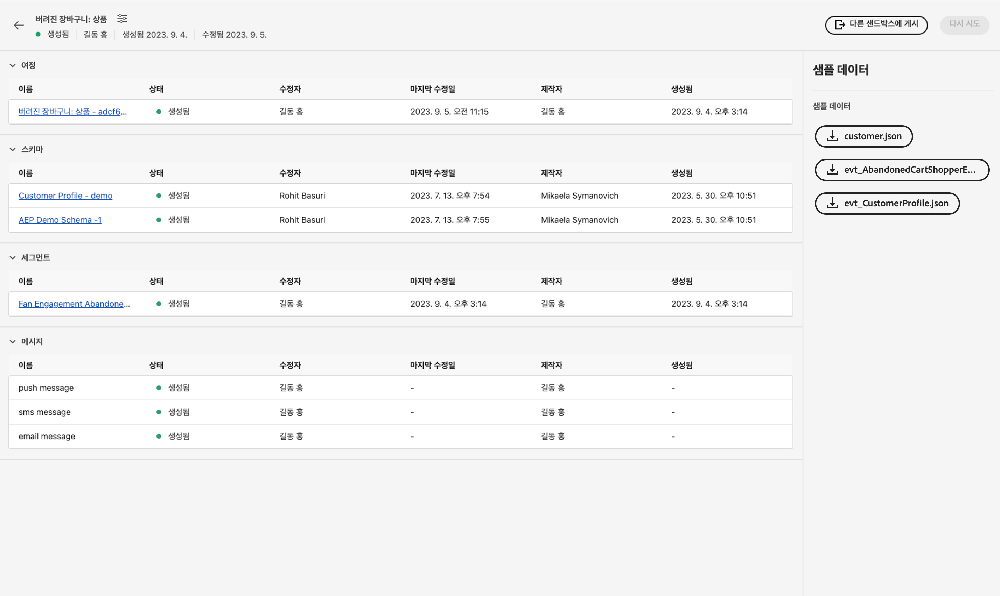

# 단일 이벤트

## 따라야 할 단계 {#steps-to-follow}

>[!CONTEXTUALHELP]
>id="marketerexp_sampledata_unitaryevent"
>title="사용 방법"
>abstract="자세한 내용은 링크를 참조하십시오"

>[!IMPORTANT]
>
>이 지침은 다음 간 변경될 수 있습니다. **[!UICONTROL 플레이북]** 따라서 항상 각 의 샘플 데이터 섹션을 참조하십시오 **[!UICONTROL 플레이북]**.

## 전제 조건

* Postman 소프트웨어가 설치되어 있어야 합니다.
* 플레이북을 사용하여 다음과 같은 인스턴스 자산을 만듭니다. **[!UICONTROL 여정]**, **[!UICONTROL 스키마]**, **[!UICONTROL 세그먼트]**, **[!UICONTROL 메시지]** 등

생성된 에셋은에 표시됩니다. `Bill Of Material` 페이지



## 필수 컬렉션으로 Postman 준비

1. 방문 **[!UICONTROL 사용 사례 플레이북]** 응용 프로그램.
1. 각각 클릭 **[!UICONTROL 플레이북]** 방문할 카드 **[!UICONTROL 플레이북]** 세부 정보 페이지.
1. 방문 **[!UICONTROL BOM]** 페이지를 만든 다음 **[!UICONTROL 샘플 데이터]** 섹션.
1. 다운로드 `postman.json` UI에서 해당 버튼을 클릭합니다.
1. 가져오기 `postman.json` 다음에서 **[!DNL Postman Software]**.
1. 이 유효성 검사를 위한 전용 Postman 환경 만들기(예: `Adobe <PLAYBOOK_NAME>`).

## IMS 토큰 가져오기

>[!NOTE]
>
>모든 환경 변수는 대/소문자를 구분하므로 항상 정확한 변수 이름을 사용하십시오.

1. 팔로우하십시오 [Experience Platform API 인증 및 액세스](https://experienceleague.adobe.com/docs/experience-platform/landing/platform-apis/api-authentication.html) 액세스 토큰을 생성하기 위한 설명서입니다.
1. 다음과 같은 환경 변수에 액세스 토큰 값 저장 `ACCESS_TOKEN`.
1. 다음과 같은 기타 인증 관련 값 저장 `API_KEY`, `IMS_ORG` 및 `SANDBOX_NAME` 을 참조하십시오.

>[!IMPORTANT]
>
>Postman에서 API를 실행하기 전에 필요한 모든 환경 변수를 추가해야 합니다.

## 플레이북에서 만든 여정 게시

여정을 게시하는 방법에는 두 가지가 있습니다. 다음 중 하나를 선택할 수 있습니다.

1. **AJO UI 사용** - 의 여정 링크를 클릭합니다. `Bill Of Material Page`; 클릭하면 표시되는 여정 페이지로 리디렉션됩니다. **[!UICONTROL 게시]** 버튼과 여정이 게시됩니다.

   

1. **Postman API 사용**

   1. 트리거 **[!DNL Publish Journey]** 요청 대상: **[!DNL Journey Publish]** > **[!DNL Queue journey publish job]**.
   1. 여정 게시에는 시간이 걸릴 수 있으므로 상태를 확인하려면 다음까지 여정 게시 상태 확인 API를 실행하십시오. `response.status` 은(는) `SUCCESS`: 여정 게시에 시간이 걸리는 경우 10~15초 정도 기다려야 합니다.

   >[!NOTE]
   >
   >모든 환경 변수는 대/소문자를 구분하므로 항상 정확한 변수 이름을 사용하십시오.

## 고객 프로필 수집

>[!TIP]
>
>를 추가하여 동일한 이메일 주소를 다시 사용할 수 있습니다. `+<variable>` 을 이메일에 포함시킵니다. 예: `usertest@email.com` 다음과 같이 재사용할 수 있습니다. `usertest+v1@email.com` 또는 `usertest+24jul@email.com`. 매번 새로운 프로필을 만드는 것이 유용하지만 여전히 동일한 이메일 ID를 사용합니다.

1. 처음 사용자는 다음을 만들어야 합니다. **[!DNL customer dataset]** 및 **[!DNL HTTP Streaming Inlet Connection]**.
1. 을(를) 이미 만든 경우 **[!DNL customer dataset]** 및 **[!DNL HTTP Streaming Inlet Connection]**, 단계로 건너뛰십시오. `5`.
1. 트리거 **[!DNL Customer Profile Ingestion]** > **[!DNL Create Customer Profile InletId]** > **[!DNL Create Dataset]** 만들려면 **[!DNL customer dataset]**; 이렇게 하면 `CustomerProfile_dataset_id` postman 환경 변수.
1. 만들기 **[!DNL HTTP Streaming Inlet Connection]**, 아래에서 Postman API 사용 **[!DNL Customer Profile Ingestion > Create Customer Profile InletId]**.

   1. `CustomerProfile_dataset_id` postman 환경 변수에서 사용할 수 있어야 합니다. 그렇지 않은 경우 단계를 참조하십시오. `3`.
   1. 트리거 **[!DNL `CREATE Base Connection`]** 끝 [!DNL create base connection].
   1. 트리거 **[!DNL `CREATE Source Connection`]** 끝 [!DNL create source connection].
   1. 트리거 **[!DNL `CREATE Target Connection`]** 끝 [!DNL create target connection].
   1. 트리거 **[!DNL `CREATE Dataflow`]** 끝 [!DNL create dataflow].
   1. 트리거 **[!DNL `GET Base Connection`]**- 자동으로 저장됩니다. `CustomerProfile_inlet_id` postman 환경 변수

1. 이 단계에서는 다음을 수행해야 합니다. `CustomerProfile_dataset_id` 및 `CustomerProfile_inlet_id` postman 환경 변수에서, 그렇지 않은 경우 단계를 참조하십시오. `3` 또는 `4` 각각.
1. 고객을 수집하려면 사용자가 저장해야 합니다. `customer_country_code`, `customer_mobile_no`, `customer_first_name`, `customer_last_name` 및 `email` postman 환경 변수.

   1. `customer_country_code` 는 모바일 번호의 국가 코드입니다. 예: `91` 또는 `1`
   1. `customer_mobile_no` 은 모바일 번호입니다. 예: `9987654321`
   1. `customer_first_name` 는 사용자의 이름입니다.
   1. `customer_last_name` 은(는) 사용자의 성이 됩니다.
   1. `email` 는 사용자의 이메일 주소입니다. 이는 새 프로필을 수집할 수 있도록 고유 이메일 id를 사용하는 데 중요합니다.

1. Postman 요청 업데이트 **[!DNL Customer Ingestion]** > **[!DNL Customer Streaming Ingestion]** 고객의 기본 채널을 변경하려면(기본적으로) [!DNL `email`] 이(가) 요청에 구성되었습니다.

   ```js
   "consents": {
       "marketing": {
           "preferred": "email",
           "email": {
               "val": "y"
           },
           "push": {
               "val": "n"
           },
           "sms": {
               "val": "n"
           }
       }
   }
   ```

1. 기본 설정 채널을 다음으로 변경 `sms` 또는 `push` 및 각 채널 값을 다음으로 만들기 `y` 및 `n` 다른 값(예:

   ```js
   "consents": {
       "marketing": {
           "preferred": "sms",
           "email": {
               "val": "n"
           },
           "push": {
               "val": "n"
           },
           "sms": {
               "val": "y"
           }
       }
   }
   ```

1. Finally 트리거 **[!DNL `Customer Profile Ingestion > Customer Profile Streaming Ingestion`]** 고객 프로필을 수집합니다.

## 이벤트 수집

1. 사용자가 처음으로 다음을 생성해야 하는 경우 **[!DNL event dataset]** 및 **[!DNL HTTP Streaming Inlet Connection for events]**
1. 을(를) 이미 만든 경우 **[!DNL event dataset]** 및 **[!DNL HTTP Streaming Inlet Connection for events]**, 단계로 건너뛰십시오. `5`.
1. 트리거 **[!DNL `Schemas Data Ingestion > AEP Demo Schema Ingestion > Create AEP Demo Schema InletId > Create Dataset`]** 만들려면 **[!DNL event dataset]**, 다음에 대한 `AEPDemoSchema_dataset_id` postman 환경 변수에서
1. 만들기 **[!DNL HTTP Streaming Inlet Connection for events]**, 아래에서 Postman API 사용 **[!DNL Schemas Data Ingestion]** > **[!DNL AEP Demo Schema Ingestion]** > **[!DNL Create AEP Demo Schema InletId]**.

   1. `AEPDemoSchema_dataset_id` postman 환경 변수에서 사용할 수 있어야 합니다. 그렇지 않은 경우 단계를 참조하십시오. `3`
   1. 트리거 **[!DNL `CREATE Base Connection`]** 끝 [!DNL create base connection]
   1. 트리거 **[!DNL `CREATE Source Connection`]** 끝 [!DNL create source connection]
   1. 트리거 **[!DNL `CREATE Target Connection`]** 끝 [!DNL create target connection]
   1. 트리거 **[!DNL `CREATE Dataflow`]** 끝 [!DNL create dataflow]
   1. 트리거 **[!DNL `GET Base Connection`]**- 자동으로 저장됩니다. `AEPDemoSchema_inlet_id` postman 환경 변수

1. 이 단계에서는 다음을 수행해야 합니다. `AEPDemoSchema_dataset_id` 및 `AEPDemoSchema_inlet_id` postman 환경 변수에서 그렇지 않은 경우 단계를 참조하십시오. `3` 또는 `4` 각각
1. 이벤트를 수집하려면 사용자가 시간 변수를 변경해야 합니다 `timestamp` 의 요청 본문 **[!DNL Schemas Data Ingestion]** > **[!DNL AEP Demo Schema Ingestion]** > **[!DNL AEP Demo Schema Streaming Ingestion]** 우편 배달부에서요.

   1. `timestamp` 이벤트 발생 시간, 현재 타임스탬프 사용(예: ) `2023-07-21T16:37:52+05:30` 필요에 따라 시간대를 조정합니다.

1. 트리거 **[!DNL Schemas Data Ingestion > AEP Demo Schema Ingestion > AEP Demo Schema Streaming Ingestion]** 이벤트를 수집하여 여정을 트리거할 수 있습니다.

## 최종 유효성 검사

에 사용된 선호 채널에서 메시지를 수신해야 합니다. **[!DNL Ingest the Customer Profile]** 단계 `8`

* `SMS` 기본 채널이 `sms` 날짜 `customer_country_code` 및 `customer_mobile_no`
* `Email` 기본 채널이 `email` 날짜 `email`

또는 다음을 확인할 수 있습니다. `Journey Report`을(를) 클릭하여 선택합니다. `Journey Object` 날짜 `Bill of Materials page` 다음으로 리디렉션됩니다. `Journey Details page`.

게시된 모든 여정 사용자는 **[!UICONTROL 보고서 보기]** 단추


## 정리

의 인스턴스가 여러 개 없습니다. `Journey` 동시에 실행하려는 경우 유효성 검사가 완료된 후에만 유효성 검사를 하는 경우에는 여정을 중지하십시오.
